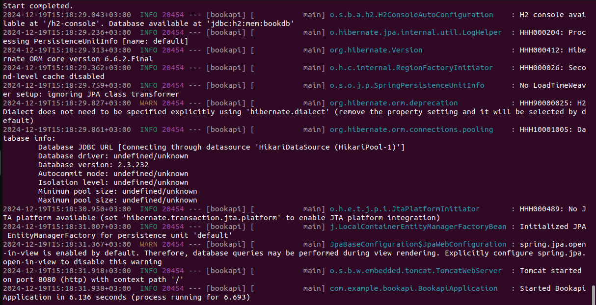
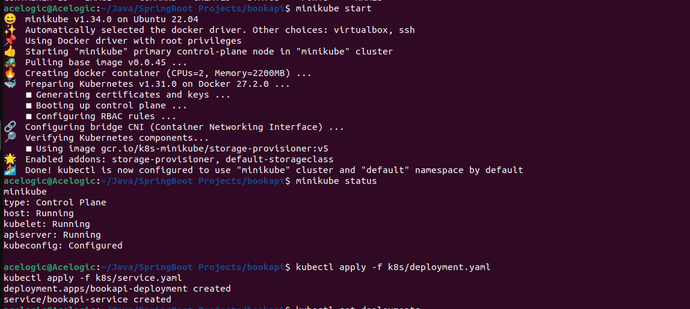
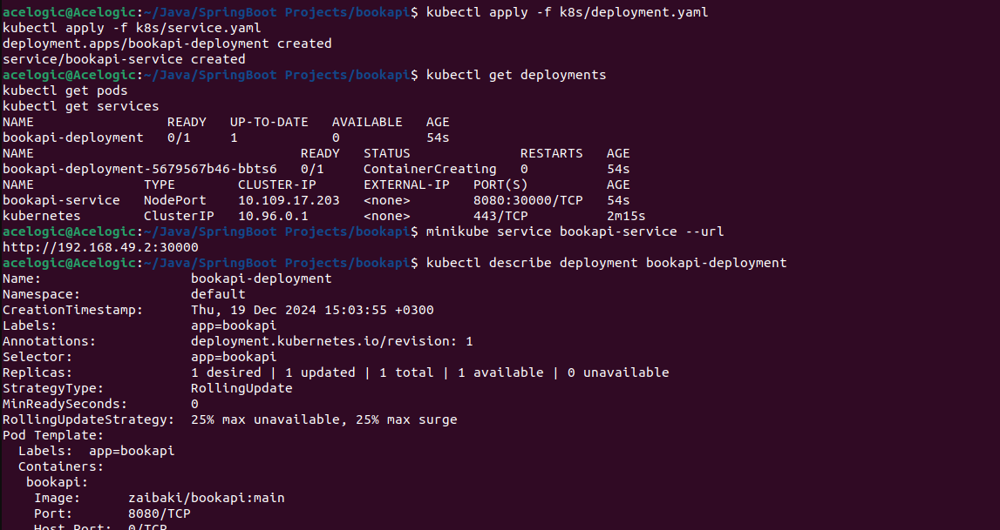
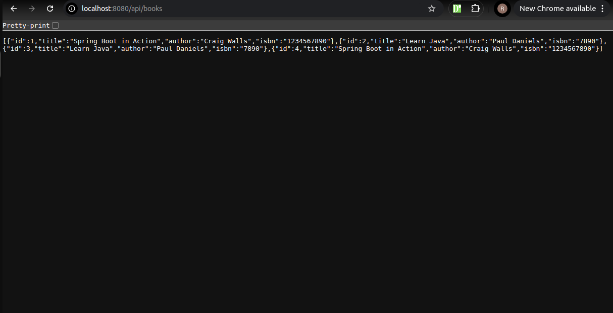

# Book Management API

A RESTful book management service built with Spring Boot, featuring Docker containerization and automated CI/CD pipeline with GitHub Actions and Kubernetes deployment capabilities.

## Table of Contents

- [Technologies Used](#technologies-used)
- [Local Development](#local-development)
- [Docker Setup](#docker-setup)
- [Kubernetes Deployment](#kubernetes-deployment)
- [CI/CD Pipeline](#cicd-pipeline)
- [API Endpoints](#api-endpoints)
- [Technical Decisions & Challenges](#technical-decisions--challenges)
- [Contributing](#contributing)
- [License](#license)

## Technologies Used

- Java 17
- Spring Boot 3.2.1
- Spring Data JPA
- H2 Database
- Docker
- Kubernetes (Minikube)
- GitHub Actions
- Maven

## Local Development

### Prerequisites

- Java 17
- Maven
- Docker
- Minikube
- kubectl

### Building the Application

Clone the repository:

```bash
git clone https://github.com/RichardKaranuMbuti/bookapi.git
cd bookapi
```

Build with Maven:

```bash
./mvnw clean package
```

Run locally (without Docker):

```bash
./mvnw spring-boot:run
```
You should see


The application will be available at [http://localhost:8080](http://localhost:8080).

## Docker Setup

### Building the Docker Image Locally

Build the image:

```bash
docker build -t bookapi .
```

Run the container:

```bash
docker run -p 8080:8080 bookapi
```

### Using Pre-built Image from Docker Hub

```bash
docker pull zaibaki/bookapi:main
docker run -p 8080:8080 zaibaki/bookapi:main
```

## Kubernetes Deployment

### Minikube Setup

Start Minikube:

```bash
minikube start
```

Verify Minikube status:

```bash
minikube status
```


### Deploying the Application

Apply Kubernetes manifests:

```bash
kubectl apply -f k8s/deployment.yaml
kubectl apply -f k8s/service.yaml
```

Verify deployment:

```bash
kubectl get deployments
kubectl get pods
kubectl get services
```

Access the application:

```bash
minikube service bookapi-service --url

remember to suffix /api/books on the browser after the url
```

### Monitoring and Troubleshooting

View pod logs:

```bash
kubectl logs <pod-name>
```

Describe deployment:

```bash
kubectl describe deployment bookapi-deployment
```

Describe service:

```bash
kubectl describe service bookapi-service
```
You should see an output similar to the one below



### Cleanup

Remove all Kubernetes resources:

```bash
kubectl delete -f k8s/
```

## CI/CD Pipeline

Our GitHub Actions workflow automates the following steps:

### Trigger

- Activates on push to main branch or pull requests.

### Build

- Checks out code.
- Sets up JDK 17.
- Builds with Maven.

### Docker

- Logs into Docker Hub using repository secrets.
- Builds Docker image.
- Pushes to Docker Hub registry.

### Tagging Strategy

- Branch name (e.g., `main`).
- PR number for pull requests.
- Git SHA for commit reference.

### Setting up CI/CD

#### Create Docker Hub access token:

1. Go to Docker Hub → Account Settings → Security → New Access Token.
2. Name it (e.g., "github-actions").
3. Copy the generated token.

#### Add GitHub repository secrets:

1. Go to repository Settings → Secrets and variables → Actions.
2. Add `DOCKERHUB_USERNAME` and `DOCKERHUB_TOKEN`.

## API Endpoints

### Get All Books

```bash
curl http://localhost:8080/api/books
```
you should see something like


### Create New Book

```bash
curl -X POST \
  http://localhost:8080/api/books \
  -H 'Content-Type: application/json' \
  -d '{
    "title": "Spring Boot in Action",
    "author": "Craig Walls",
    "isbn": "1234567890"
  }'
```

## Technical Decisions & Challenges

### Architecture Decisions

- **H2 Database**: Chose H2 for development simplicity. For production, consider switching to PostgreSQL or MySQL.
- **NodePort Service**: Used NodePort for easy local access. In production, consider using LoadBalancer or Ingress.
- **Resource Limits**: Set conservative CPU and memory limits to prevent resource exhaustion.

### Security Considerations

- Docker Hub credentials stored as GitHub secrets.
- No sensitive data in Docker images or Git repository.
- Container runs without root privileges.

### Known Limitations

- In-memory database - data doesn't persist between restarts.
- Basic CRUD operations only.
- No authentication/authorization implemented.
- Single instance deployment (no high availability).

### Future Improvements

- Add persistent volume for database.
- Implement security (Spring Security).
- Add health checks and monitoring.
- Implement database migrations.
- Add API documentation (Swagger/OpenAPI).
- Set up horizontal pod autoscaling.

## Contributing

Please read `CONTRIBUTING.md` for details on our code of conduct and the process for submitting pull requests.

## License

This project is licensed under the MIT License - see the `LICENSE.md` file for details.